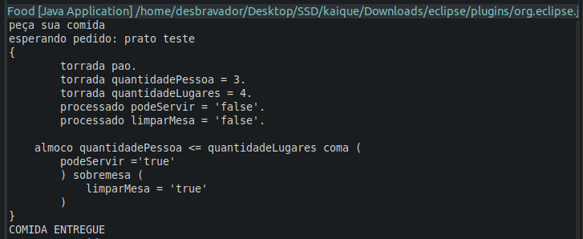
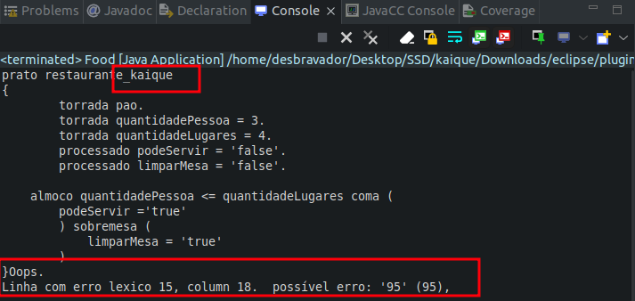

# DOCUMENTAÇÃO ADMINSITRAÇÃO USUARIO LINUX 

Nessa documentação vamos trabalhar com grupos, usuários e permissões em ambiente linux 

### 📋 Pré-requisitos


Servidor linux 

PuttySSH


###  Criando nossos grupos 
```
sudo addgroup transporte_logistica
sudo addgroup contabilidade
sudo addgroup recursos_humano
sudo addgroup estudantes
sudo addgroup todos
```
###  Cirando usuarios
aqui vamos criar todos nossos usuários para que possamos atribuirmos a grupos e suas devidas permissões, a criação com o comando '-m' é a criação no home do nosso ambiente, com o mando sudo useradd -help podemos verificar na tabela  
```
sudo useradd -m Daniel 
sudo useradd -m Erik  
sudo useradd -m Diemos 
sudo useradd -m Marcos 
sudo useradd -m Roberto 
sudo useradd -m Pedro  
sudo useradd -m estudante_01
sudo useradd -m estudante_02
```
###  Organizando nossos gruops com usuários  
Vamos agora atribuir aos grupos os usuarios criados em nosso sistema
o tag -G é para groups, quando queremos adicionar o mesmo usuário a mais de um grupo
```
sudo usermod -G <NameGrupo>,<Namegrupo> <username>

sudo usermod -G transporte_logistica,todos Daniel
sudo usermod -G transporte_logistica,todos Erik
sudo usermod -G transporte_logistica,todos Diemos
sudo usermod -G transporte_logistica,todos Marcos

sudo usermod -G contabilidade,todos Roberto
sudo usermod -G contabilidade,todos Pedro

sudo usermod -G recursos_humano Roberto
sudo usermod -G recursos_humano,todos Marcos

sudo usermod -G estudantes,todos estudante_01
sudo usermod -G estudantes,todos estudante_02


```
###  Tokens IDs 
```
< NUMERO> 		::= (< DIGITO >)+ 
< #DIGITO> 	    ::= [ 0-9 ] 
< ID> 			::= <LETRA> (< LETRA> | < DIGITO>)* 
< LETRA>		::= [A-Z] | [a-z] 
< BOOL>		    ::= (TRUE | FALSE | true | false)
< ASPAS>		::= '

```
###  Operadores lógicos e de comprações   
```
<MENORIGUAL> ::=    <=
<MAIORIGUAL>::=     >=
<IGUAL>		::=     ==
<DIFERENTE>	::=     !=
<E> 		::=     &&
<OU>		::=     ||
```
### Operadores matematicos   
```
<MAIS>		::=     +
<MENOS>		::=     -
<MULTI>		::=     *
<DIV>		::=     /
<MAIOR>		::=     >
<MENOR>		::=     <
<ATRIBUI>	::=     =
```

### Comprações comparacao()  
```
<MAIOR> | <MENOR> | <MENORIGUAL> | <MAIORIGUAL> | <DIFERENTE> | <IGUAL>
```

### tipagem  
```
 <TIPOINTEIRO > | <TIPOBOOL > | <TPSTRING > | <TPREAL>
```

### decração de variaveis  
```
     <TIPOINTEIRO> (<ID> (atribuicaoVar())* <FIM_STRUC>)+
	| <TIPOBOOL> (<ID> (atribuicaoVar())* <FIM_STRUC>)+
	| <TPSTRING> (<ID> (atribuicaoVar())* <FIM_STRUC>)+
```

### Entrada de dadoos   -
```
	<ID> | <NUMERO>
```

### Condições de operações logicos  
```
(<entrada> <comparacao> <entrada> <operacao_logica>) *
```
### Atribuição de valores 
```
	 <ATRIBUI> (<NUMERO> | <ASPAS><ID><ASPAS> ) 
```

### Estrutura principal  
```
	<INICIOPROGRAMA> <ID> 
    <ABREBLOCO>
        <declara_variavel>
        <body>
    <FECHABLOCO>
```

### 📋 demonstração de como é a estrutura basica
```
<INICIO_PROGRAMA> <ID> <ABREBLOCO>
    <TIPOINTEIRO> <ID> <FIM_STRUCT>
    <CONDIF> <ID> | <DIGITO>  <comparacao>   <ID> | <DIGITO>
    <ABREBLOCOND>
        <VARIAVEL_DECLARADA> <atribuicaoVar> <DIGITO> | <ID>
    <FECHABLOCOND>
    <CONDELSE> 
        <ABREBLOCOND>
             <VARIAVEL_DECLARADA> <atribuicaoVar> <DIGITO> | <ID>
         <FECHABLOCOND>
<FECHABLOCO>
```


### 📋 exemplo executavel da estrutura vista a cima

vamos manter as palavras chaves de nosso programa substituindo e adicionando variaveis com valores e condicionando a execução

```
prato teste
{ 
	torrada pao.
	torrada quantidadePessoa = 3. 
	torrada quantidadeLugares = 4. 
	processado podeServir = 'false'.
	processado limparMesa = 'false'.

    almoco quantidadePessoa <= quantidadeLugares coma (  
        podeServir ='true' 
	) sobremesa ( 
	    limparMesa = 'true'
	) 
}
```

### Imagem a baixo com programa aceito pela linguagem:



### Imagem a baixo com programa aceito pela linguagem:


## ✒️ Autores

Mencione todos aqueles que ajudaram a levantar o projeto desde o seu início

* **Desenvolvedor** -  Kaique Andrade
* **Desenvolvedor** -  
