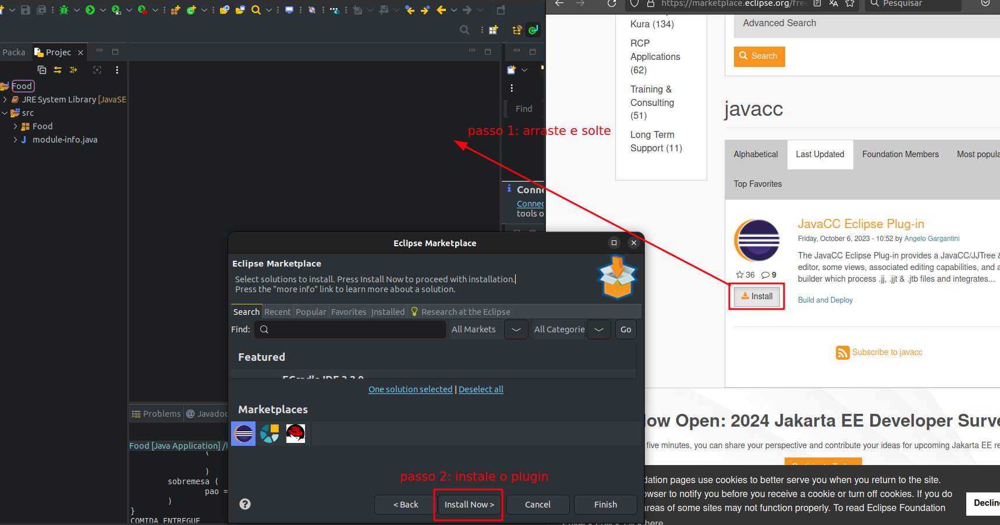
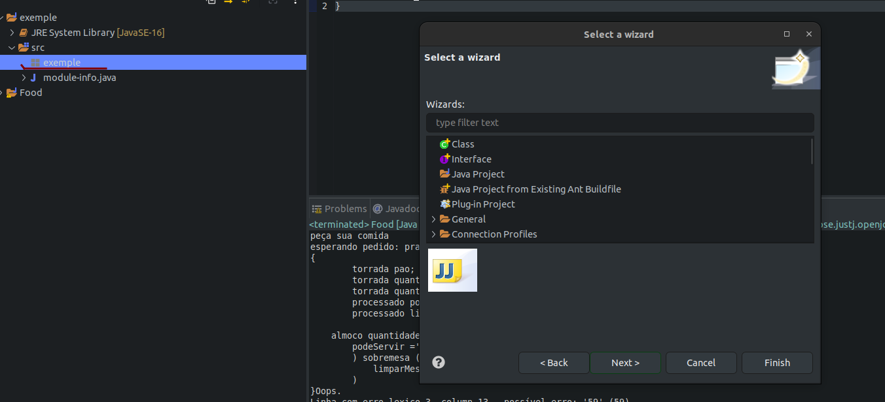

# DOCUMENTAÇÃO LINGUAGEM EM FORMATO BACKS-NAUR

aqui vamos explicitar tipos de dados e estrutura
para que possamos realizar um programa basico na linguagem feita em javacc com conceitos em comidas.

### 📋 Pré-requisitos


Eclipse IDE 

pulgin javacc 

https://www.eclipse.org/downloads/packages/installer

https://marketplace.eclipse.org/free-tagging/javacc

### 🔧 Instalação

Após o download e instalação basica do eclipse abra a IDE na sua workspace va para o linki do plugin do JavaCC e no botão de install click e arraste para dentro da workspace da IDE e faça sua intalação

Imagem a baixo demonstra a instalção:

cliclando com botação direito no package va em other e escolha javaCC



Termine com um exemplo de como obter dados do sistema ou como usá-los para uma pequena demonstração.

## ⚙️ Executando um programa básico

O programa segue conceitos basicos de programação, function nome da function com inicio e fim de bloco, condições básicas como if e comandos de repetição tbm estão presentes 


### 📋 Tokens utilizados para definição das palavras de nosso programa básico

nossa linguagem inspirada em comidas utiliza palavras chaves (Tokens) para definir a execuções básicas de nosso programa.

###  tipo de dados  
```
<TPSTRING>  ::= torrada
<TPREAL>    ::= agua
<TIPOBOOL>  ::= processado
<TPREAL>    ::= agua
```
###  Estrutura do programa 
```
<INICIOPROGRAMA>::= prato
<ABREBLOCO>     ::= {
<FECHABLOCO>    ::= }
<ABREBLOCOND>   ::= (
<FECHABLOCOND>  ::= )
< FIM_STRUC>	::= .
```
###  Estrutura condicional  
```
<CONDIF>        ::= almoco
<CONDELSE>      ::= sobremesa
<REPWHILE>      ::= rodizio
<REPFOR>        ::= degustacao
<ENTAO>         ::= coma
```
###  Tokens IDs 
```
< NUMERO> 		::= (< DIGITO >)+ 
< #DIGITO> 	    ::= [ 0-9 ] 
< ID> 			::= <LETRA> (< LETRA> | < DIGITO>)* 
< LETRA>		::= [A-Z] | [a-z] 
< BOOL>		    ::= (TRUE | FALSE | true | false)
< ASPAS>		::= '

```
###  Operadores lógicos e de comprações   
```
<MENORIGUAL> ::=    <=
<MAIORIGUAL>::=     >=
<IGUAL>		::=     ==
<DIFERENTE>	::=     !=
<E> 		::=     &&
<OU>		::=     ||
```
### Operadores matematicos   
```
<MAIS>		::=     +
<MENOS>		::=     -
<MULTI>		::=     *
<DIV>		::=     /
<MAIOR>		::=     >
<MENOR>		::=     <
<ATRIBUI>	::=     =
```

### Comprações comparacao()  
```
<MAIOR> | <MENOR> | <MENORIGUAL> | <MAIORIGUAL> | <DIFERENTE> | <IGUAL>
```

### tipagem  
```
 <TIPOINTEIRO > | <TIPOBOOL > | <TPSTRING > | <TPREAL>
```

### decração de variaveis  
```
     <TIPOINTEIRO> (<ID> (atribuicaoVar())* <FIM_STRUC>)+
	| <TIPOBOOL> (<ID> (atribuicaoVar())* <FIM_STRUC>)+
	| <TPSTRING> (<ID> (atribuicaoVar())* <FIM_STRUC>)+
```

### Entrada de dadoos   -
```
	<ID> | <NUMERO>
```

### Condições de operações logicos  
```
(<entrada> <comparacao> <entrada> <operacao_logica>) *
```
### Atribuição de valores 
```
	 <ATRIBUI> (<NUMERO> | <ASPAS><ID><ASPAS> ) 
```

### Estrutura principal  
```
	<INICIOPROGRAMA> <ID> 
    <ABREBLOCO>
        <declara_variavel>
        <body>
    <FECHABLOCO>
```

### 📋 demonstração de como é a estrutura basica
```
<INICIO_PROGRAMA> <ID> <ABREBLOCO>
    <TIPOINTEIRO> <ID> <FIM_STRUCT>
    <CONDIF> <ID> | <DIGITO>  <comparacao>   <ID> | <DIGITO>
    <ABREBLOCOND>
        <VARIAVEL_DECLARADA> <atribuicaoVar> <DIGITO> | <ID>
    <FECHABLOCOND>
    <CONDELSE> 
        <ABREBLOCOND>
             <VARIAVEL_DECLARADA> <atribuicaoVar> <DIGITO> | <ID>
         <FECHABLOCOND>
<FECHABLOCO>
```


### 📋 exemplo executavel da estrutura vista a cima

vamos manter as palavras chaves de nosso programa substituindo e adicionando variaveis com valores e condicionando a execução

```
prato teste
{ 
	torrada pao.
	torrada quantidadePessoa = 3. 
	torrada quantidadeLugares = 4. 
	processado podeServir = 'false'.
	processado limparMesa = 'false'.

    almoco quantidadePessoa <= quantidadeLugares coma (  
        podeServir ='true' 
	) sobremesa ( 
	    limparMesa = 'true'
	) 
}
```

### Imagem a baixo com programa aceito pela linguagem:


### Imagem a baixo com programa aceito pela linguagem:


## ✒️ Autores

Mencione todos aqueles que ajudaram a levantar o projeto desde o seu início

* **Desenvolvedor** -  Kaique Andrade
* **Desenvolvedor** -  
